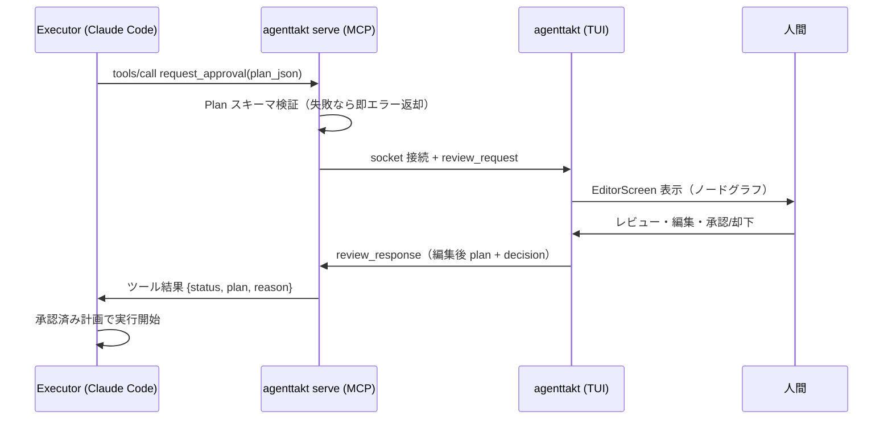

# アーキテクチャ

AgentTakt は「MCP サーバープロセス」と「TUI プロセス」の 2 プロセス構成である。

## なぜ 2 プロセスか

Claude Code 等の Executor は MCP サーバーをサブプロセスとして spawn し、stdin/stdout を JSON-RPC（stdio transport）の通信路として専有する。このため MCP サーバープロセスは同一プロセス内で Textual TUI を起動できない（TUI が必要とする対話的な stdio / TTY が使えない）。

そこで、人間が別ターミナルで起動する TUI 常駐プロセスを設け、両者を Unix domain socket で接続する。

```
Claude Code (Executor)
   │ stdio (MCP JSON-RPC)                     人間の別ターミナル
   ▼                                                │
[agenttakt serve] ──── Unix domain socket ────▶ [agenttakt]
 MCP サーバー                                    TUI 常駐プロセス
 socket クライアント（薄い・状態なし）           socket サーバー + Textual App
```

- **socket のリスナーは TUI 側**。長命なプロセスに socket ファイルの所有権とライフサイクル（作成・stale 検出・後始末）を一本化するため。
- **MCP プロセスは状態を持たない**。Claude Code の都合でいつ spawn/kill されてもよい薄いクライアントに徹する。

## 承認フロー（シーケンス）



## プロセスのライフサイクル

| プロセス | 起動 | 終了 | 異常系 |
|---|---|---|---|
| `agenttakt serve` | Executor が `.mcp.json` 経由で spawn | Executor が kill | TUI 未接続時は `request_approval` がエラーを返し、人間に TUI 起動を促す文面を Executor へ渡す |
| `agenttakt`（TUI） | 人間が別ターミナルで起動・常駐 | `q` / Ctrl+C | 終了時に socket を unlink（finally + SIGINT/SIGTERM handler）。起動時に stale socket を検出したら unlink して再 bind |

## 複数リクエストの扱い

- 1 接続 1 リクエスト。TUI 側 `BridgeServer` は複数接続を受理し FIFO キューに積む。
- TUI は先頭から 1 件ずつ `EditorScreen` に表示し、ヘッダに待機件数を出す。
- 応答は接続オブジェクトに紐付けて返すため、`request_id` の取り違えは構造的に起きない。
- Executor 側のタイムアウト・キャンセルで接続が落ちた場合（reader EOF で検出）、該当リクエストをキューから除去する。編集中なら通知して IdleScreen に戻る。

## タイムアウトに関する重要な制約

人間の承認待ちで `request_approval` は数分〜数十分ブロックする。MCP の progress notification ではクライアント側タイムアウトは延長されないため、**利用側 `.mcp.json` の該当サーバーに `timeout`（ミリ秒）を明示設定することが必須**である。設定例は [README](../README.md) を参照。

## モジュール構成

```
src/agenttakt/
  cli.py                 # エントリポイント（agenttakt / at）
  models/                # Plan データモデルと自動レイアウト
  bridge/                # socket プロトコル・クライアント・サーバー
  server/mcp_server.py   # MCP ツール定義（SDK import はこのファイルに限定）
  tui/                   # Textual アプリ（screens / widgets / geometry）
```

- MCP SDK は v1 `FastMCP`（`mcp>=1.9,<2`）にピン留め。import を `server/mcp_server.py` に閉じ込め、将来の v2（`MCPServer`）移行を 1 ファイル差分で済ませる。
- TUI のエッジ描画は経路計算（`tui/geometry.py`）と文字化（`tui/widgets/edge_layer.py`）を分離し、角丸直角線 → braille 曲線への差し替えを可能にする。
