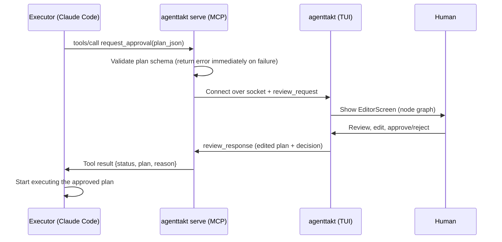

# Architecture

AgentTakt runs as two processes: an **MCP server process** and a **TUI process**.

## Why two processes

Executors such as Claude Code spawn the MCP server as a subprocess and take over its stdin/stdout as the JSON-RPC channel (stdio transport). That means the MCP server process cannot start a Textual TUI in the same process — the interactive stdio/TTY the TUI needs is already occupied.

So the TUI lives in a long-running process the human starts in a separate terminal, and the two are connected over a Unix domain socket.

```
Claude Code (Executor)
   │ stdio (MCP JSON-RPC)                    your other terminal
   ▼                                                │
[agenttakt serve] ──── Unix domain socket ────▶ [agenttakt]
 MCP server                                     TUI process
 socket client (thin, stateless)                socket server + Textual App
```

- **The listener lives on the TUI side.** Ownership of the socket file and its lifecycle (creation, stale detection, cleanup) belongs to the long-lived process.
- **The MCP process is stateless.** It stays a thin client that can be spawned or killed by Claude Code at any time.

## Approval flow



## Process lifecycle

| Process | Start | Stop | Failure handling |
|---|---|---|---|
| `agenttakt serve` | Spawned by the Executor via `.mcp.json` | Killed by the Executor | If no TUI is connected, `request_approval` returns an error telling the Executor to ask the human to start the TUI |
| `agenttakt` (TUI) | Started by the human in a separate terminal | `q` / Ctrl+C | Unlinks the socket on exit (`finally` + SIGINT/SIGTERM handler). On startup, a stale socket is detected, unlinked, and re-bound |

## Handling multiple requests

- One request per connection. The TUI's `BridgeServer` accepts multiple connections and queues them FIFO.
- The TUI shows them one at a time in `EditorScreen`, with the pending count in the header.
- Responses are tied to the connection object, so mixing up `request_id`s is structurally impossible.
- If a connection drops because of an Executor-side timeout or cancellation (detected via reader EOF), the corresponding request is removed from the queue. If it was being edited, the human is notified and returned to the idle screen.

## Important timeout constraint

`request_approval` blocks for minutes to tens of minutes while waiting for human approval. MCP progress notifications do not extend the client-side timeout, so **setting `timeout` (milliseconds) explicitly for this server in the consumer's `.mcp.json` is required**. See the [README](../../README.md) for a configuration example.

## Module layout

```
src/agenttakt/
  cli.py                 # entry point (agenttakt / at)
  models/                # Plan data model and auto layout
  bridge/                # socket protocol, client, and server
  server/mcp_server.py   # MCP tool definitions (SDK imports confined to this file)
  tui/                   # Textual app (screens / widgets / geometry)
```

- The MCP SDK is pinned to v1 `FastMCP` (`mcp>=1.9,<2`). Imports are confined to `server/mcp_server.py` so a future v2 (`MCPServer`) migration is a one-file diff.
- TUI edge rendering separates path computation (`tui/geometry.py`) from character rendering (`tui/widgets/edge_layer.py`), so rounded orthogonal lines can be swapped for braille curves.
